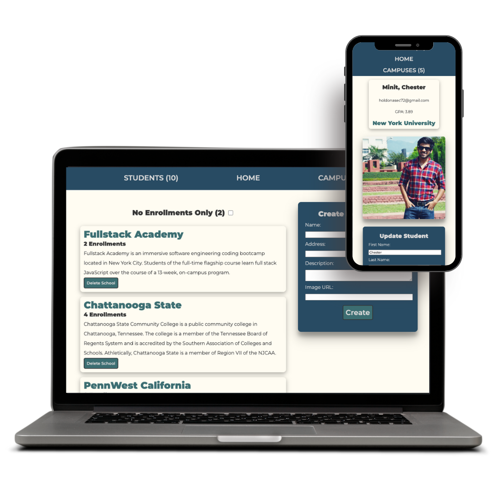

# Enrollments CRUD Application

This project is designed to mimic the interface of an application that manages different school campuses as well as the students enrolled.

Key Features:

<ul>
<li>Create, Read, Update, and Delete campuses/students</li>
<li>Intuitive, mobile-friendly interface</li>
<li>Sort students/campuses by enrollment status</li>
<li>Precise form validation</li>
<li>Addresses link to Google Maps for driving directions</li>
</ul>

Fun fact: Each of the campuses listed in the seed file is an actual
school that I have attended!
˝
## Getting Started
### Local Machine (command line)
- $npm i
- $createdb acme_school
- $npm start

## Technologies Used

For this project, I used: 
- JavaScript
- React
- Node
- Less
- Express
- PostgreSQL
- Sequelize

## What I Learned
- I became much more comfortable with linking up an entire application from front to back end.
- I learned the wonders of CSS preprocessors and how they can make your life much easier!
- How important it is to pace yourself during a long project to prevent burn out. Frequent breaks make for a productive developer! :-)

